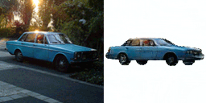
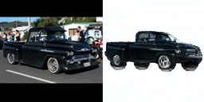

# Semi-parametric Object Synthesis

<p align="center">
  
</p>

## Abstract

We present a new semi-parametric approach to synthesize novel views of an object from a single monocular image. First, we exploit man-made object symmetry and piece-wise planarity to integrate rich *a-priori* visual information into the novel viewpoint synthesis process. An *Image Completion Network* (ICN) then leverages 2.5D sketches rendered from a 3D CAD as guidance to generate a realistic image. In contrast to concurrent works, we do not rely solely on synthetic data but leverage instead existing datasets for 3D object detection to operate in a real-world scenario. Differently from competitors, our semi-parametric framework allows the handling of a wide range of 3D transformations. Thorough experimental analysis against state-of-the-art baselines shows the efficacy of our method both from a quantitative and a perceptive point of view.

## Paper

<p align="center">
 <table>
  <tr>
  <td align="center"><a href="https://arxiv.org/abs/1907.10634" target="_blank"></a></td>
  </tr>
  <tr>
  <td><pre>  
@article{palazzi2019semi,
  title={Semi-parametric Object Synthesis},
  author={Palazzi, Andrea and Bergamini, Luca and Calderara, Simone and Cucchiara, Rita},
  journal={arXiv preprint arXiv:1907.10634},
  year={2019}
}
</pre></td>
  </tr>
</table> 
</p>


## Code

### Install

Run the following in a fresh Python 3.6 environment to install all dependencies:

```bash
pip install -r requirements.txt
```

Code was tested on Ubuntu linux only (16.04, 17.04).

### How to run

To run our demo code, you need to download the following:
- Pascal3D+ vehicles dataset (`.zip` file [here](https://drive.google.com/open?id=1tP0MNK-505d8OWoyIp267JhkIfJt7jh1))
- 3D CADs (`.zip` file [here](https://drive.google.com/open?id=1V5sysWzg-jVfY50cYZzjg6cgoIgzu8u0))
- Pre-trained weights (`.pth` file [here](https://drive.google.com/open?id=1rF5sz_kXMmcu7wK9e6_PLqTh59GGIbuq))

Extract both archives in a location of your choice `<data_root>`;  move there the pre-trained weights file too.

The entry point is [`run_rotate.py`](https://github.com/iccv19sub265/semiparametric/blob/master/run_rotate.py). The script expects as mandatory arguments the car dataset, pre-trained weights and CAD dir.

Therefore, it can be run as follows:
```bash
python run_rotate.py <data_root>/pascal_car <data_root>/weights.pth <data_root>/cad --device cpu
```

### Description and usage

If everything went well,, you should see a GUI like the following:

<p align="center">
  
</p>

The GUI is composed of two windows: the *viewport* and the *output* one.

While the focus is on the *viewport*, keyboard can be used to move around the object in spherical coordinates. [Here](https://github.com/iccv19sub265/semiparametric/blob/master/help.txt) the full list of commands is provided. While you move, the *output* shows both Image Completion Network (ICN) inputs (2.5D sketches, appearance prior) and network prediction. Please refer to Sec.3 of the paper for details.

*Notice*: it may happen that when starting the program, open3D does not render anything. This is an initialization issue. In case this happens, just focus on the *viewport* and press spacebar a couple of times until you see both windows rendered properly.

## Supplementary Material

### Other classes

<p align="center">
  
</p>

### Extreme viewpoint transformations (see Sec. 4)

**Due to its *semi-parametric* nature, our method can handle extreme viewpoint changes.**

Manipulating radius        |  Manipulation elevation   | Arbitrary rototranslation
:-------------------------:|:-------------------------:|:-------------------------:
     |     |  

Chairs backflip                      |
:-----------------------------------:|
  |

### Data augmentation (see Sec. 4.4)

Additional examples generated synthetically using our model are shown below.

Each row is generated as follows. Given an image from [Pascal3D+](http://cvgl.stanford.edu/projects/pascal3d.html), other examples in the same pose are randomly sampled from the dataset. Then, our method is used to transfer the appearance of the latter to the pose of the first. Eventually, generated vehicles are stiched upon the original image. For a seamless collaging, we perform a small Gaussian blur at the mask border.

<p align="center">
  
</p>

Percentage of Correct Keypoints (PCK) logged in TensorBoard during training (see Sec. 4.4)
<p align="center">
  
</p>

---

## Datasets ([link](https://drive.google.com/open?id=1P_AkpS0NlaNnU7JxU6-faB0uOmR0mX6s) for download)

<p align="center">
  
</p>

**We release two datasets of 3D models (*cars*, *chairs*) with annotated 3D keypoints.**

#### Dataset structure
Currently, there are 59 annotated models for car and 73 for chair.

3D models come from [ShapeNet](https://www.shapenet.org/) and have been converted in `.ply` format (with colors).

Each example of the datasets is composed of the following components:
* One `.ply` file containing the 3D model mesh and colors.
* One `.yaml` file containing the 3D keypoints annotation
* One `.jpg` image of the model thumbnail.

#### Annotation
Annotated keypoints are the ones in [Pascal3D+](http://cvgl.stanford.edu/projects/pascal3d.html): 12 for cars and 10 for chairs.

Car keypoints: *front wheel*, *back_wheel*, *upper windshield*, *upper rearwindow*, *front light*, *back trunk* (2x, left and right).
Chair keypoints: *back upper*, *seat upper*, *seat lower*, *leg upper*, *leg lower* (2x, left and right).

#### Terms of use

We believe that research should be as open as possible and we are happy if these datasets can be helpful for your research too. If you use these data, please cite [our research work](https://github.com/ndrplz/semiparametric#paper).

Since 3D models come from ShapeNet database, if you use this dataset you agree to ShapeNet [terms of use](https://www.shapenet.org/terms).

